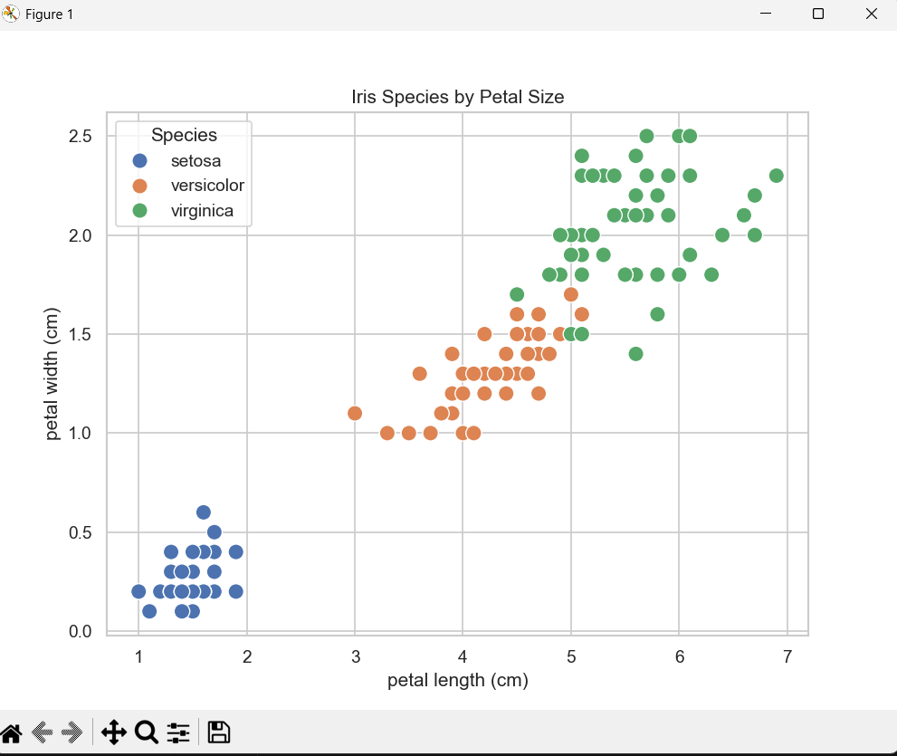

# iris-flower-classification
My first machine learning project using scikit-learn


# Iris Flower Classification Project 

This is my first machine learning project!  
I built an AI model that predicts the species of an iris flower based on its sepal and petal measurements — just by looking at numbers!

## About the Dataset
- Built-in **Iris dataset** from scikit-learn
- 150 flower samples
- 3 species:
  1. Iris setosa
  2. Iris versicolor
  3. Iris virginica
- Features: sepal length, sepal width, petal length, petal width

##  What the Model Does
- Trained using **Logistic Regression** (a simple ML algorithm)
- Accuracy: ~95–100% (tested on unseen data)
- Can predict the species of a **new flower** in seconds!

##  Visualization
Here's how the species differ by petal size:



> You can see that *setosa* is very different from the other two — it has much smaller petals!

## 🏁 How to Run This Project

### 1. Install Required Libraries
```bash
pip install scikit-learn pandas matplotlib seaborn
